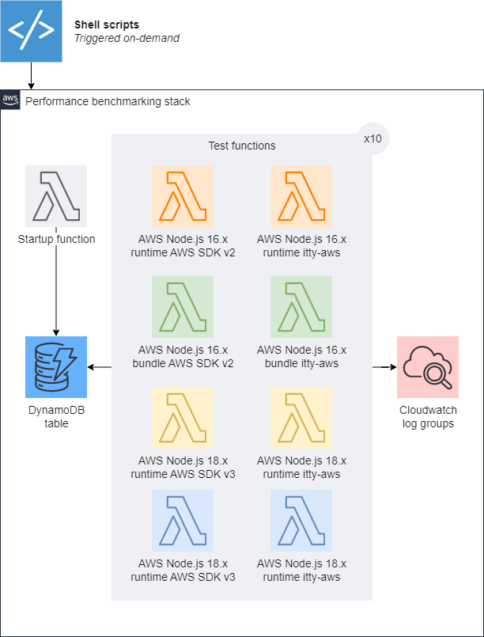

[🏠 Home](../README.md)

# ⚡ itty-aws benchmarking

We compare itty-aws in various runtime environments and against AWS-SDK v2 and v3 to ensure it performs at least as well as the native tools provided by AWS.

## Browse the reports

<!-- LATEST REPORT START -->

Latest benchmark

- [2023-04-16: advanced-benchmarking](./data/advanced-benchmarking-1/README.md)

<!-- LATEST REPORT END -->

<!-- PREVIOUS REPORTS START

Previous benchmarks

- None

<!-- PREVIOUS REPORTS END -->

## How to run the benchmark

Prerequesite : AWS CLI credentials are correctly configured, `itty-aws` has been [built successfully](../CONTRIBUTING.md).

1. Bootstrap the CDK  
   `pnpm bench:bootstrap`
1. Deploy the benchmarking stack  
   `pnpm bench:deploy`
1. Run the benchmark  
   `pnpm bench:run`
1. Collect and consolidate the benchmark results  
   `pnpm bench:consolidate`
1. Generate the report and update the index  
   `pnpm bench:report`
1. Manual finishes
   1. Analyze and comment the report in `/benchmark/data/my-branch/README.md`as needed
   1. Update the reports index in `/benchmark/data/README.md`
   1. Commit and push the result

## Benchmarking architecture and methodology

A simple benchmarking stack is deployed on the AWS Cloud:

- 1x DynamoDB table
- 1x setup lambda that puts a 10KB item in the DynamoDB table
- 10x lambdas of each test configuration described in the following table:

| Name               | Runtime          | SDK                              |
| ------------------ | ---------------- | -------------------------------- |
| aws16-sdk2-runtime | AWS Node.js 16.x | runtime AWS-SDKv2                |
| aws16-itty-runtime | AWS Node.js 16.x | itty-aws with runtime AWS-SDK v2 |
| aws16-sdk2-bundle  | AWS Node.js 16.x | bundle AWS-SDKv2                 |
| aws16-itty-bundle  | AWS Node.js 16.x | itty-aws with bundle AWS-SDK v2  |
| aws18-sdk3-runtime | AWS Node.js 18.x | runtime AWS-SDKv3                |
| aws18-itty-runtime | AWS Node.js 18.x | itty-aws with runtime AWS-SDK v3 |
| aws18-sdk3-bundle  | AWS Node.js 18.x | bundle AWS-SDKv3                 |
| aws18-itty-bundle  | AWS Node.js 18.x | itty-aws with bundle AWS-SDK v3  |

The lambdas code is pretty simple. They perform a single read on DynamoDB with the target SDK and log the result.

Notably, the lambdas have the following options enabled to compare `itty-aws` with real àws-sdk` production conditions:

- `context.callbackWaitsForEmptyEventLoop=false`
- `awsSdkConnectionReuse: true`

The target document size is 10KB. We need some load, because if the document is too small, there's no point in measuring both HTTP request and API call latencies since they're almost the same.

We use the first execution of the 10 instances of each type of function to analyse cold starts, and the other invocations to analyse warm starts.
