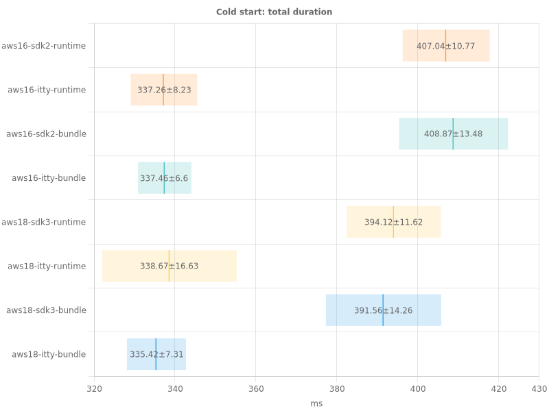
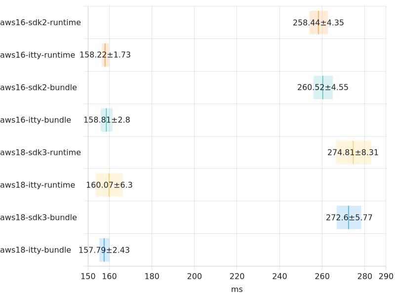
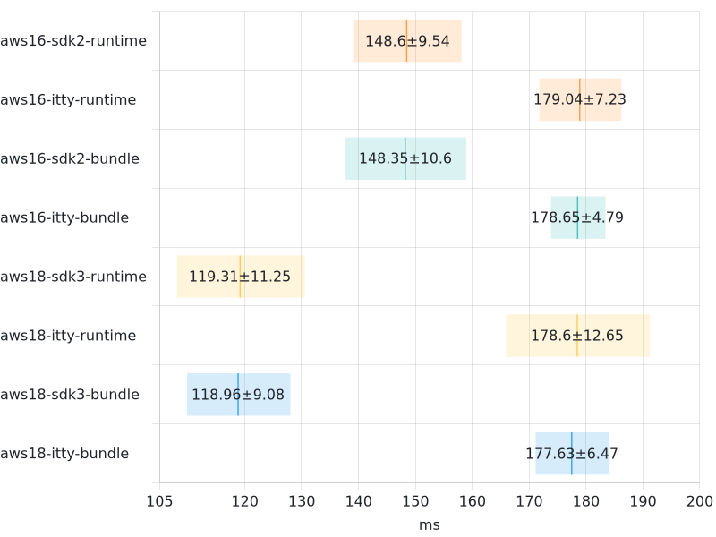
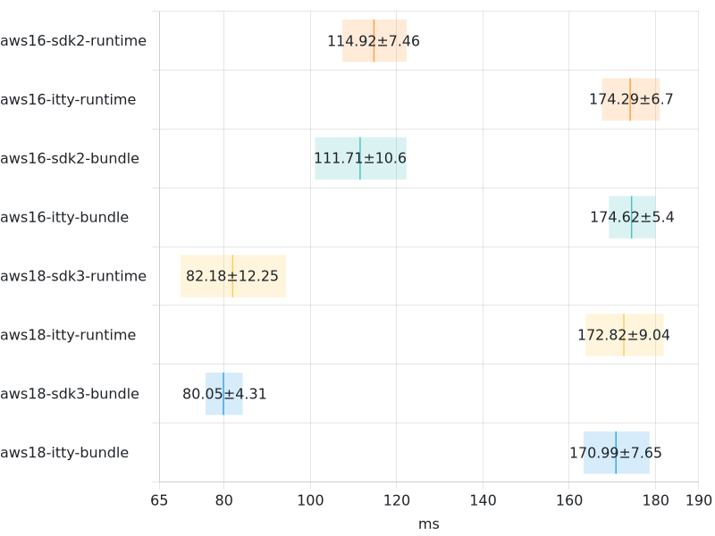
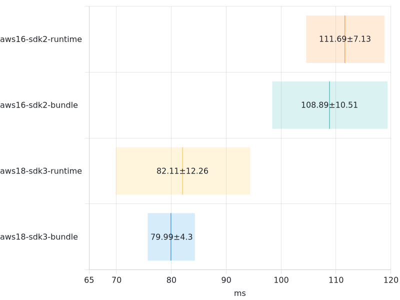
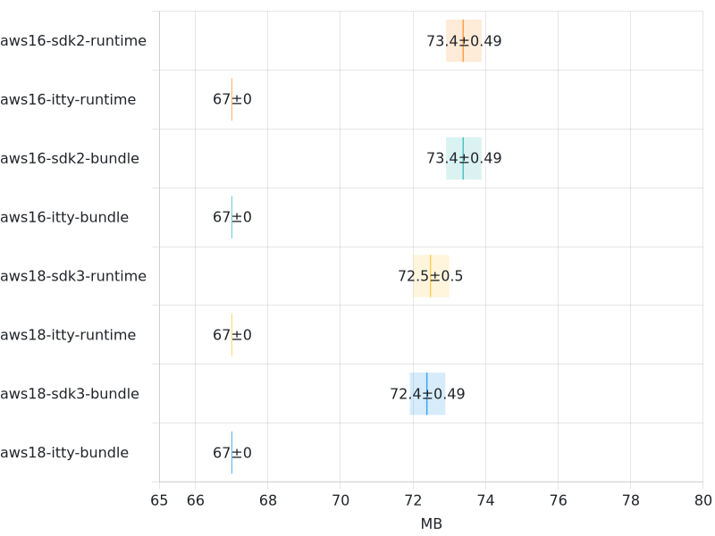
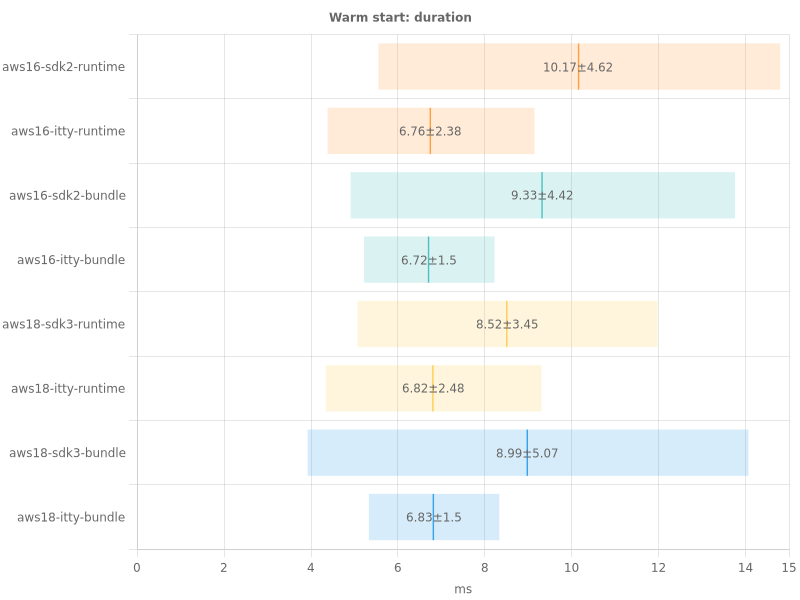
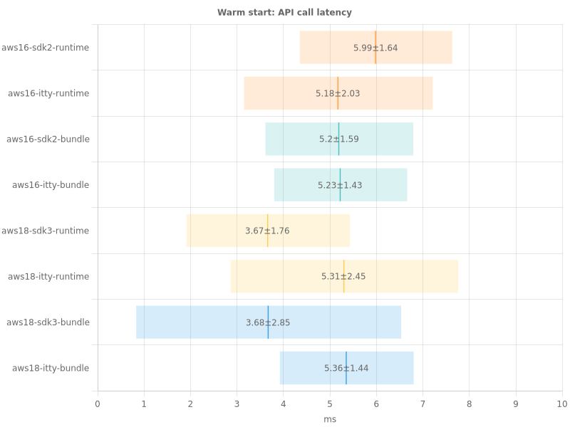
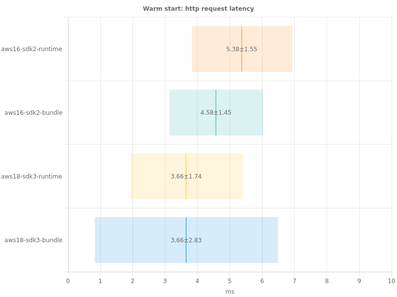
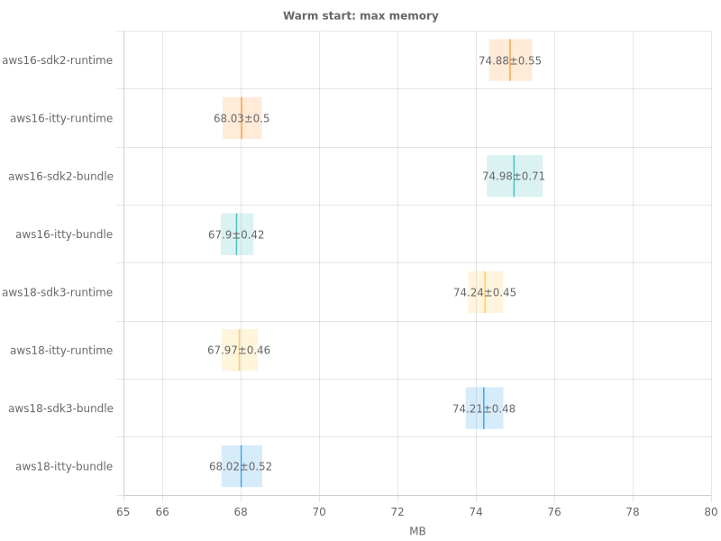

# Benchmark report

- Branch: jpb-benchmark
- Date: 4/16/2023, 2:51:58 PM

## Cold starts

### Cold starts total duration

### Cold starts init duration

### Cold starts duration

### Cold starts API call latency

### Cold starts HTTP Request latency

### Cold starts max memory

## Warm starts

### Warm starts duration

### Warm starts API call latency

### Warm starts HTTP request latency

### Warm starts max memory

